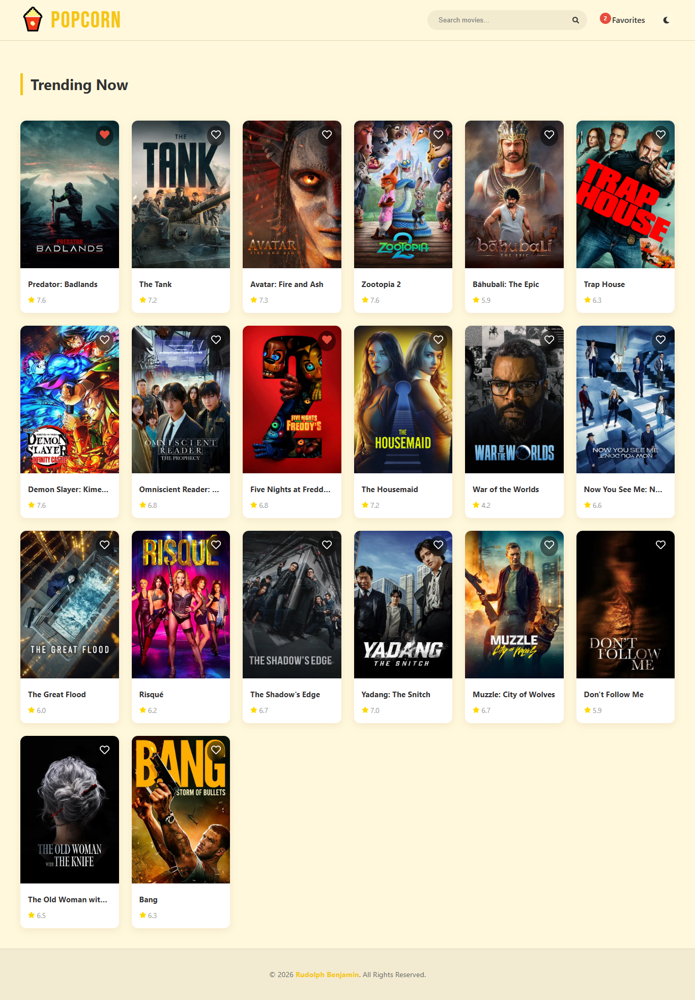
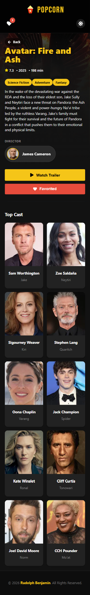

# Deployment Documentation

## Project Name

Popcorn – Find Your Favorite Movies !

## Deployment URL

https://popcorn-ecru.vercel.app/

## Screenshots

## Deployment Using Vercel

I deployed the project using Vercel because it provides a fast and simple deployment process. Vercel is directly integrated with GitHub, supports automatic builds, and delivers stable performance without complex configuration.
